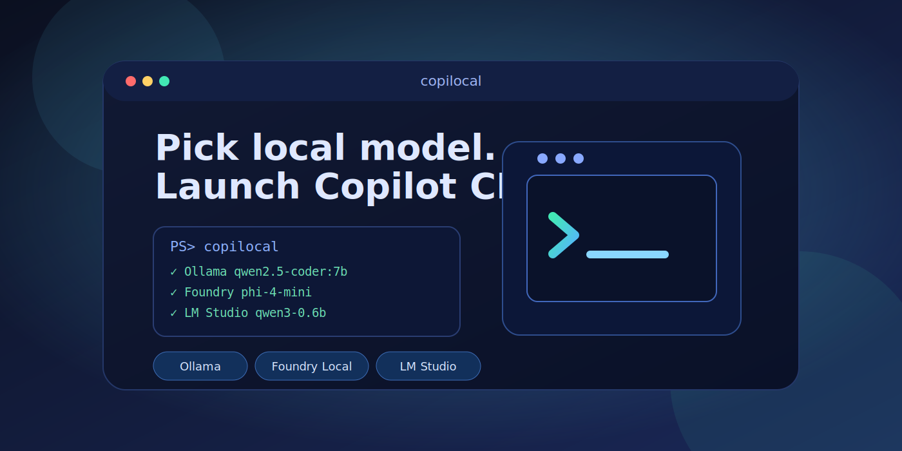
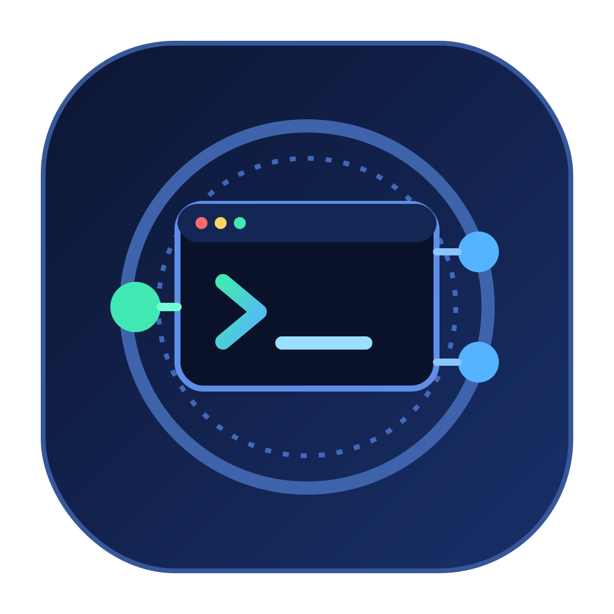

# copilocal

Pick a **local LLM** from an arrow-key terminal menu and launch **GitHub Copilot CLI** against it.

`copilocal` discovers the models you already have in **Ollama**, **Foundry Local**, and
**LM Studio**, lets you choose one in an arrow-key menu, makes sure that provider's
OpenAI-compatible server is running, then starts `copilot` with the right BYOK
environment variables — **set only on the Copilot child process**, never persisted to
your shell.

If a provider isn't installed, copilocal offers to install it (checkbox opt-in, with
links to each tool's docs so you can decide).

[](https://github.com/garylumsden/copilocal/actions/workflows/ci.yml)
[](https://github.com/garylumsden/copilocal/actions/workflows/release.yml)
[](https://github.com/garylumsden/copilocal/releases)
[](LICENSE)


<p align="center">
  
</p>

<p align="center">
  
</p>

> ⚠️ **Not affiliated with GitHub or Microsoft.** copilocal is an independent,
> community-built tool. It is **not** affiliated with, endorsed by, or sponsored by
> GitHub, Microsoft, OpenAI, Ollama, or LM Studio. It simply launches the official
> **GitHub Copilot CLI** that *you* install separately. See
> [Disclaimer & trademarks](#disclaimer--trademarks).

```text
(startup animation: icon flies in left→right, reveals the wordmark, then settles on the right)

 ██████╗ ██████╗ ██████╗ ██╗██╗      ██████╗  ██████╗ █████╗ ██╗       ╭─════════════─╮
██╔════╝██╔═══██╗██╔══██╗██║██║     ██╔═══██╗██╔════╝██╔══██╗██║       │  ┄┄┄┄┄┄┄┄┄┄  ├─●
██║     ██║   ██║██████╔╝██║██║     ██║   ██║██║     ███████║██║     ●─┤   >_         │
██║     ██║   ██║██╔═══╝ ██║██║     ██║   ██║██║     ██╔══██║██║       │  ┄┄┄┄┄┄┄┄┄┄  ├─●
╚██████╗╚██████╔╝██║     ██║███████╗╚██████╔╝╚██████╗██║  ██║███████╗   ╰─════════════─╯
 ╚═════╝ ╚═════╝ ╚═╝     ╚═╝╚══════╝ ╚═════╝  ╚═════╝╚═╝  ╚═╝╚══════╝
      Pick a local model · launch GitHub Copilot CLI against it

Discovering local models…
  ✓ Ollama — 2 models
  ✓ Foundry Local — 2 models
  ✓ LM Studio — 1 model

Select a local model  (↑/↓, Enter to launch):
  Ollama
>   Ollama        qwen2.5-coder:7b
    Ollama        llama3.2:3b
  Foundry Local
    Foundry Local qwen2.5-coder-7b-generic-gpu
    Foundry Local phi-4-mini
  LM Studio
    LM Studio     qwen3-0.6b
  ⚙  Configure launch options
  ✖  Quit
```

## Quickstart

```powershell
# 1. Install copilocal
winget install Gjlumsden.Copilocal

# 2. Prerequisites (install separately):
#    - GitHub Copilot CLI on PATH:   copilot --version
#    - Optional now: local runtime + model (you can also install a runtime from inside copilocal on launch)
#      e.g. Ollama:
ollama pull qwen2.5-coder:7b

# 3. Ollama only — give Copilot's prompt room (64k–128k if memory allows):
setx OLLAMA_CONTEXT_LENGTH 131072         # then restart Ollama

# 4. Launch
copilocal
```

No local runtime installed yet? On **Windows**, just run `copilocal` and choose
**⚙ Install / manage providers** to install Ollama / Foundry Local / LM Studio during startup.

Pick a model with **↑/↓** and **Enter**. copilocal starts the provider if needed, warms
the model up, sets the BYOK env vars, and launches `copilot` against it. When Copilot
exits you can pick a **different model to continue the same session**, or **Exit**.

## Why

GitHub Copilot CLI supports BYOK (bring-your-own-key/model) via environment variables,
but that's **one model per session**, set by hand. copilocal turns it into a picker over
**all** your local runtimes — no proxy, no config files, no shell pollution.

## Requirements

- **GitHub Copilot CLI** (`copilot` on `PATH`) — https://github.com/github/copilot-cli
  (on Windows copilocal can install it for you at startup via winget; on macOS install it
  yourself, e.g. with Homebrew)
- At least one of: [Ollama](https://ollama.com), [Foundry Local](https://learn.microsoft.com/azure/ai-foundry/foundry-local/), [LM Studio](https://lmstudio.ai)
  (copilocal can install these for you on Windows)
  - **Foundry Local note:** copilocal expects the newer preview CLI surface (0.10+:
    `foundry cache list -o json`, `foundry server ...`). If `winget install
    Microsoft.FoundryLocal` gives you an older 0.8.x service-based CLI, use copilocal's
    installer flow or the `cli-preview-*` GitHub release instead.
- Windows x64 / ARM64, or macOS arm64 / x64 — a single self-contained binary; no .NET runtime required

### Validated with

copilocal talks to each runtime's CLI/REST surface, which shifts over time. The current
behaviour is verified against these versions (Windows 11 x64, June 2026):

| Component | Version |
| --- | --- |
| Ollama | 0.30.6 |
| LM Studio | 0.4.16 |
| Foundry Local (CLI) | 0.10.0 |
| GitHub Copilot CLI | 1.0.62 |
| .NET SDK (build) | 10.0.300 |

Newer releases usually work too; if discovery or launch misbehaves after a runtime update,
please [open an issue](https://github.com/garylumsden/copilocal/issues) noting the version.

## Install

### winget (Windows)
```powershell
winget install Gjlumsden.Copilocal
```

### Manual (Windows / macOS)
Download the binary for your platform from [Releases](https://github.com/garylumsden/copilocal/releases)
and put it on your `PATH`:

- **Windows:** `copilocal-win-x64.exe` / `copilocal-win-arm64.exe`
- **macOS:** `copilocal-osx-arm64` / `copilocal-osx-x64` — then make it runnable:
  ```bash
  chmod +x copilocal-osx-arm64
  xattr -d com.apple.quarantine copilocal-osx-arm64   # clear Gatekeeper (unsigned binary)
  ```

> On **macOS**, copilocal discovers and launches your local providers and Copilot CLI, but
> the one-click **install** flows (winget / Add-AppxPackage) are Windows-only — install
> Copilot CLI and the runtimes yourself there.

## Usage

```powershell
copilocal                      # interactive picker -> air-gap prompt -> launches copilot
copilocal -- --resume          # everything after -- is forwarded to copilot
copilocal --name "my feature"  # name the managed session (resume it later by name)
copilocal --pick 1             # non-interactive: pick model #1
copilocal --pick 1 --offline   # non-interactive: pick #1 and run air-gapped
copilocal --dry-run            # show what it would set, don't launch
```

> **Continue with a different model:** in the interactive flow copilocal assigns a
> stable `--session-id` to the Copilot session it launches. When Copilot exits, it shows
> the captured resume id/name (and the `copilot --resume=<id>` command to reopen it
> later), then drops you back to the model picker. Pick another local model to **continue
> the same conversation** with it, or choose **Exit**. This is skipped when you drive
> sessions yourself (e.g. `--resume`, `--continue`, `--session-id`).

> **Air-gapped mode:** after you pick a model, copilocal asks whether to run
> air-gapped (default **No**). Choosing yes sets `COPILOT_OFFLINE=true`, so Copilot CLI
> never contacts GitHub's servers and disables telemetry. Pass `--offline` to default
> the prompt to yes (or to enable it directly on the `--pick` path).

### How models are discovered

| Provider      | Discovery command          | Endpoint                       |
| ------------- | -------------------------- | ------------------------------ |
| Ollama        | `ollama list`              | `http://localhost:11434/v1`    |
| Foundry Local | `foundry cache list -o json` | `http://127.0.0.1:<port>/v1` (resolved at runtime) |
| LM Studio     | `lms ls --json`            | `http://localhost:1234/v1`     |

copilocal sets these on the **child** `copilot` process only:

| Environment variable | Value / when set |
| --- | --- |
| `COPILOT_PROVIDER_BASE_URL` | the chosen provider's OpenAI base URL |
| `COPILOT_PROVIDER_TYPE` | `openai` |
| `COPILOT_MODEL` | the chosen model id |
| `COPILOT_PROVIDER_API_KEY` | `local` (placeholder; local servers ignore it) |
| `COPILOT_PROVIDER_WIRE_API` | `responses` when a reasoning model needs the Responses API |
| `COPILOT_OFFLINE` | `true` in air-gapped mode |
| `COPILOT_PROVIDER_MAX_PROMPT_TOKENS` | auto-derived from model context, or your launch-options override |
| `COPILOT_PROVIDER_MAX_OUTPUT_TOKENS` | auto-derived from model context, or your launch-options override |

> Models must support **tool calling** and **streaming** to work well with Copilot CLI.
> Before launch copilocal runs **preflight guards**: it flags models that don't advertise
> tool calling, checks the model's **context window** is big enough for Copilot's large
> prompt, and—at launch—probes the chosen model to catch ones that emit tool calls as plain
> text instead of native `tool_calls` (e.g. Ollama's `qwen2.5-coder`), which silently breaks
> Copilot's agentic loop. Interactively you can override a warning; a non-interactive
> `--pick` is blocked so it fails fast with a clear reason.

### Reasoning models & context windows

A few gotchas copilocal now handles for you:

- **Reasoning models** (e.g. `gpt-oss`) reply in a `reasoning` field and leave `content`
  empty on the chat/completions wire — Copilot then loops and Ollama returns
  `400 invalid message content type: <nil>`. When the warm-up detects a reasoning model
  and the endpoint exposes `/v1/responses` (Ollama, LM Studio do), copilocal switches it
  to the OpenAI **Responses** wire API (`COPILOT_PROVIDER_WIRE_API=responses`).
- **Context too small for Copilot's prompt.** Copilot's system prompt + tools run to 20k+
  tokens, so a small window truncates it (blank replies / loops / 400). copilocal reads each
  provider's effective context and warns below **16384** tokens:
  - **Ollama** auto-sizes context from available VRAM when `OLLAMA_CONTEXT_LENGTH` is unset
    (for example 4k under 24 GiB VRAM, 32k at 24–48 GiB, 256k at 48+ GiB). For Copilot, set
    an explicit large value such as `64000` or `131072` if memory allows, then restart Ollama.
  - **Foundry Local** bakes the context into each compiled **variant**. On the validated
    `qwen2.5-coder` variants with Foundry CLI 0.10.0, the `…-openvino-npu` (NPU) build
    reported **4224** tokens (overflows as `input_ids size … exceeds max length`) and couldn't
    be widened, while GPU/CPU variants of the same model reported **32768**. Treat those as
    observed model/version values, not universal guarantees. Use a non-NPU variant, e.g.
    `foundry model download <model>-generic-gpu` (or `-generic-cpu` / `-openvino-gpu`), or
    `foundry model run <model> --device GPU`.
  - **LM Studio** loads each model at the context chosen in its **load dialog**, and the
    default *custom* length (often **8192**) is too small for Copilot. When you load the model,
    set **Context Length** to the **model maximum** (turn off the custom limit / slide it to max)
    so the loaded window fits Copilot's prompt. Otherwise you'll see
    `n_keep (…) >= n_ctx (8192) … load the model with a larger context length`.

## Recommended models

Models need **tool calling** (for Copilot's agentic loop) and ideally fit your VRAM.
Small, fast, non-reasoning coders are the safest start; reasoning models work too
(copilocal routes them via the Responses API automatically).

| Use | Ollama | Foundry Local | LM Studio |
| --- | --- | --- | --- |
| Best small coder | `qwen2.5-coder:7b` | `qwen2.5-coder-7b` | `qwen2.5-coder-7b-instruct` |
| Lighter / faster | `qwen2.5-coder:3b`, `llama3.2:3b` | `qwen2.5-coder-1.5b`, `phi-4-mini` | `llama-3.2-3b-instruct` |
| Tiny (quick tests) | `llama3.2:1b` | `qwen2.5-coder-0.5b` | `qwen3-0.6b` |
| Recent / agentic | `granite4:3b`, `qwen3:4b` | `phi-4-mini`, `qwen2.5-7b` | `granite-4.0-h-tiny`, `phi-4-mini-instruct` |

> Tags change fast — check the latest live: Ollama
> [`ollama.com/library?sort=newest`](https://ollama.com/library?sort=newest),
> Foundry with `foundry model list`, and LM Studio's in-app **Discover** catalog.

> **NPU note:** Foundry Local's `*-openvino-npu` variants run on a supported Intel/Qualcomm
> **NPU**, freeing the GPU/CPU — but the validated `qwen2.5-coder` NPU variants on Foundry CLI
> 0.10.0 reported a **4224-token** context, too small for Copilot CLI's prompt. The validated
> GPU/CPU variants of the same model reported **32768** tokens. Treat these as observed values,
> not guarantees; for copilocal, prefer a GPU/CPU variant (`-generic-gpu` / `-generic-cpu` /
> `-openvino-gpu`) when the NPU variant warns on context.

### Example: tuning to your machine

There's no single "best" model — it depends on your **VRAM** and **RAM**. A model's
weights must fit in **VRAM + RAM**; what fits in **VRAM alone runs fastest**; and a
**MoE** model (high total params, few *active* per token) lets you punch above your
VRAM *if* you have plenty of RAM — because memory is set by *total* params while speed
is set by *active* params.

As an **example only**, on a *Ryzen 9 5900X · 128 GB RAM · Radeon RX 6800 XT (16 GB VRAM)*:

- **Fits in VRAM (fastest):** a 7–14B dense model at Q4 — e.g. `qwen2.5-coder:14b`
  (~9 GB) as an everyday coder, with headroom for context.
- **Lean / snappy:** `qwen2.5-coder:7b`, `llama3.2:3b`.
- **More capability via RAM:** a low-active **MoE** such as `qwen3-coder:30b` (~3B active)
  — its ~18 GB of weights spill into the ample 128 GB RAM while only ~3B params compute
  per token, so it stays usable.
- **Context:** 16 GB VRAM comfortably handles `OLLAMA_CONTEXT_LENGTH=32768`; `131072`
  is heavy (large KV cache).
- **Avoid:** big *dense* 24B+ models — they overflow 16 GB VRAM and crawl.

## Configure launch options

The menu's **⚙ Configure launch options** item opens a page to set the flags copilocal
passes to `copilot` on every launch. Choices are saved to `~/.copilocal/config.json` and
applied automatically. Toggle (multi-select), pick a **reasoning effort**, and add any
**extra raw args**. Available toggles include:

- **MCP/skills:** disable built-in MCP (`--disable-builtin-mcps`), disable user MCP servers
  (`--disable-mcp-server=<name>` for each in `~/.copilot/mcp-config.json`), disable skills
  (`--excluded-tools=skill`)
- **Permissions:** `--allow-all-tools`, `--allow-all-paths`, `--allow-all-urls`,
  `--yolo` (allow everything)
- **Modes:** `--autopilot`, `--plan`, `--experimental`
- **Behaviour:** `--no-custom-instructions`, `--no-ask-user`, `--enable-memory`,
  `--no-remote`, `--disallow-temp-dir`, `--enable-reasoning-summaries`
- **UI/maintenance:** `--banner`, `--screen-reader`, `--no-color`, `--no-auto-update`
- **Reasoning effort:** `--reasoning-effort` = `none` / `low` / `medium` / `high` / `xhigh` / `max`

Plus a free-text **extra args** field for any other `copilot` flag. The page shows a
preview of the resulting launch command. Disabling MCP servers and skills shrinks
Copilot's prompt a lot — useful for local models with limited context.

### Token budget

Unknown local models aren't in Copilot's catalog, so Copilot falls back to generic
`COPILOT_PROVIDER_MAX_PROMPT_TOKENS` / `MAX_OUTPUT_TOKENS` defaults that can overshoot the
model's real context and truncate to empty/garbled output. copilocal **auto-derives** them
from the model's actual context — Ollama via `OLLAMA_CONTEXT_LENGTH`, LM Studio via its
loaded context (`/api/v1/models`) — reserving room for the reply
(`prompt ≈ context − output − buffer`, `output ≈ context/4`, capped at 8192). Override
either with the **Max prompt tokens** / **Max output tokens** fields in *Configure launch
options* (blank = auto).

## Installing providers

If a runtime is missing, copilocal shows it in the menu. Choosing **Install / manage
providers** opens a checkbox list (space to toggle) with a docs link for each:

- **Ollama** — winget (`Ollama.Ollama`)
- **LM Studio** — winget (`ElementLabs.LMStudio`)
- **Foundry Local** — latest CLI MSIX from [microsoft/Foundry-Local](https://github.com/microsoft/Foundry-Local) releases (matches your CPU architecture)

For Foundry Local, that installer intentionally uses the compatible `cli-preview-*` release
instead of assuming the `Microsoft.FoundryLocal` winget package has the same CLI surface.

## Build from source

```powershell
git clone https://github.com/garylumsden/copilocal.git
cd copilocal
dotnet run                                   # debug
dotnet publish -c Release -r win-x64         # single AOT exe -> bin/Release/net10.0/win-x64/publish/
dotnet publish -c Release -r win-arm64
```

Requires the .NET 10 SDK. Output is a self-contained, Native-AOT single executable.

> **Native AOT on Windows** needs the Visual Studio C++ toolchain (Desktop development
> with C++) for the linker; `dotnet run`/`dotnet build` work without it.

Run the test suite:

```powershell
dotnet test tests/Copilocal.Tests/Copilocal.Tests.csproj
```

### Project layout

Source is grouped by responsibility, one namespace per folder:

| Folder / namespace | What's in it |
| --- | --- |
| `Copilocal` (root) | `Program` — entry point and interactive orchestration |
| `Cli` → `Copilocal.Cli` | `CommandLineArgs` — argv parsing |
| `Providers` → `Copilocal.Providers` | `ProviderHub` (discovery + lifecycle), `ProviderInfo`, `ProviderInstaller`, `MenuItem` |
| `Launch` → `Copilocal.Launch` | `Launcher`, `Preflight` (guards), `LaunchConfig` |
| `Ui` → `Copilocal.Ui` | `Banner`, `InstallFlow`, `LaunchOptionsPage` (Spectre.Console pages) |
| `Infrastructure` → `Copilocal.Infrastructure` | `ProcessRunner`/`HttpGateway` (+ interfaces), `Json` |

Dependency direction stays one-way: `Infrastructure ← Providers ← Launch ← Ui`, with `Cli`
standalone and `Program` wiring everything together.

## Contributing

Issues and PRs are welcome. Please keep changes small and focused, run
`dotnet build -c Debug` and `dotnet test` before opening a PR (both must be green), and
match the existing style (interface-backed `IProcessRunner`/`IHttpGateway` for testability,
hand-built JSON helpers so the build stays Native-AOT friendly). Report bugs and request
features on the [issue tracker](https://github.com/garylumsden/copilocal/issues).

## License

[MIT](LICENSE)

## Disclaimer & trademarks

copilocal is an independent, unofficial project and is **not affiliated with, endorsed
by, or sponsored by** GitHub, Microsoft, OpenAI, Ollama, or LM Studio. It launches the
official **GitHub Copilot CLI** that you install and authenticate separately, and it
talks to local runtimes you install yourself.

"GitHub", "GitHub Copilot", "Microsoft", "Foundry Local", "Ollama", and "LM Studio" are
trademarks of their respective owners and are used here for identification only. Use of
GitHub Copilot remains subject to GitHub's terms; bringing your own model does not change
your obligations under those terms.
